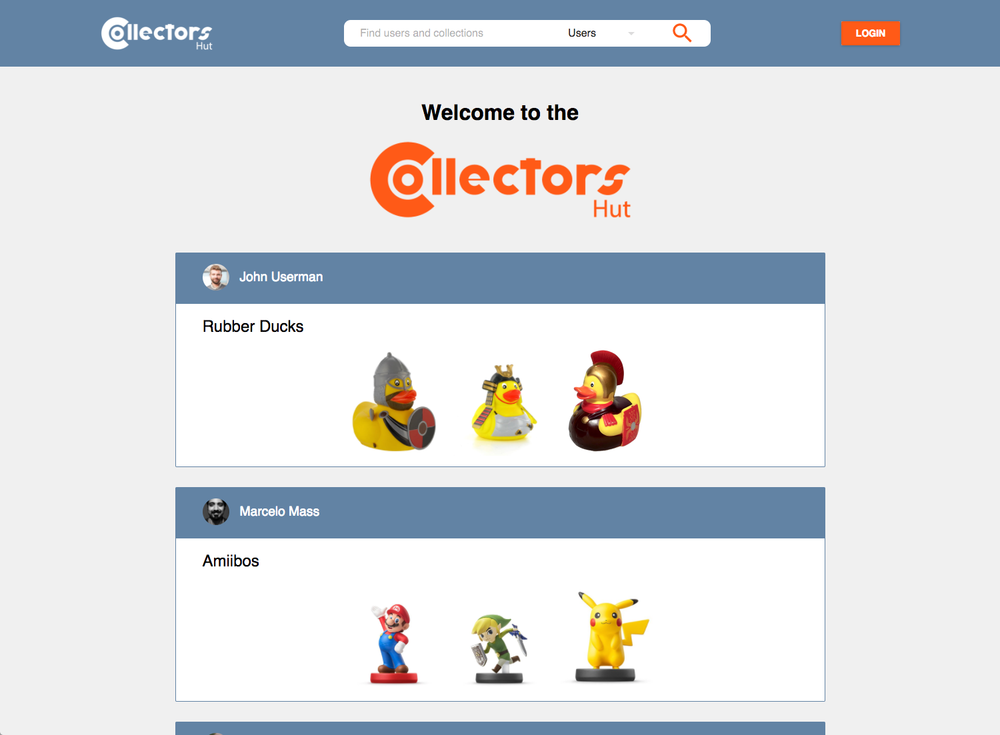

  
  

    A social network for collectors to share and display interests on novelty, vintage and all other types of collections
  

## Table of Contents ##
- [Introduction](#introduction)
- [Tech Stack](#tech-stack)
  - [The Frontend](#the-frontend)
  - [The Backend](#the-backend)
- [Pics](#pics)
- [Coming Soon](#coming-soon)

## Introduction ##

My Capstone Project for the Full-Stack Development program at <a href="https://propulsionacademy.com/" target="_blank">Propulsion Academy</a>.

## Tech Stack ##

### The Frontend ###

- <a href="https://reactjs.org/" target="_blank">React</a> - JavaScript library for building user interfaces
- <a href="https://redux.js.org/" target="_blank">Redux</a> - JavaScript library for managing application state
- <a href="http://www.material-ui.com/#/" target="_blank">Material-UI</a> - React components that implement Google's Material Design

### The Backend ###

<a href="https://github.com/GoPerdomo/collectors_hut-backend" target="_blank">Backend Repository</a>

- <a href="https://nodejs.org/en/" target="_blank">Node.js</a> - JavaScript on the server-side
- <a href="https://expressjs.com/" target="_blank">Express</a> - Web Framework for Node.js
- <a href="http://mongoosejs.com/" target="_blank">Mongoose</a> - MongoDB Object Modeling for Node.js
- <a href="https://www.mongodb.com/" target="_blank">MongoDB</a> - NoSQL Database

## Pics ##

  

## Coming Soon ##

- **Responsive Design** - Automatically adapt to the device's screen size
- **Deployment to Heroku** - Cloud Platform
